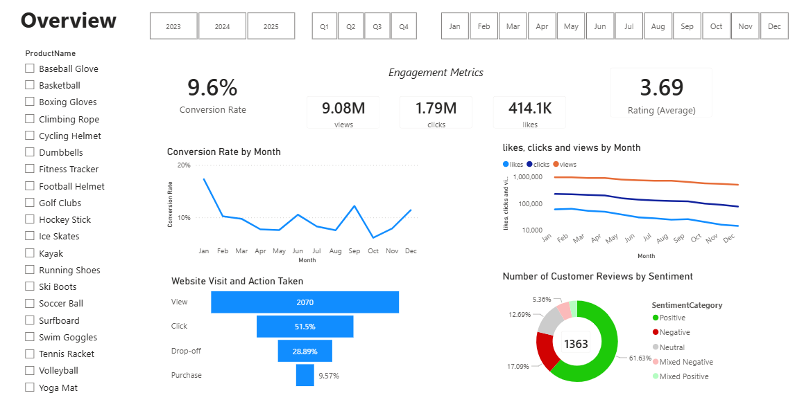

# 📊 ProGear Sports Marketing Analytics Dashboard

## 🧩 Project Overview

ProGear Sports, an online retail business, experienced declining customer engagement and conversion rates despite launching several marketing campaigns.

This project performs end-to-end data analysis using SQL, Python, and Power BI to uncover performance gaps, understand customer behavior, and deliver data-driven recommendations.

---

## 🎯 Business Objectives

- Analyze marketing campaign effectiveness
- Understand customer demographics and behavior
- Evaluate customer sentiment from reviews
- Identify drivers of low conversion
- Provide actionable business recommendations

---

## 🛠 Tools & Technologies

- **SQL Server** — data extraction and transformation
- **Python (Transformers, Pandas)** — advanced sentiment analysis
- **Power BI** — dashboard development and visualization

---

## 🗄 Data Preparation (SQL)

SQL was used for data cleaning, feature engineering, and transformation before loading into Power BI.

### Key SQL Tasks

**Product segmentation**

- Created price categories (Low, Medium, High)

**Customer enrichment**

- Joined customers with geography
- Built age group segmentation

**Review cleaning**

- Removed formatting inconsistencies in review text

**Engagement processing**

- Standardized content types
- Split combined views/clicks field
- Formatted engagement dates
- Filtered out newsletter traffic

**Customer journey cleaning**

- Identified duplicate journey records using window functions
- Removed duplicates
- Imputed missing duration using average by visit date

These steps ensured high-quality, analysis-ready data for the dashboard.

---

## 🤖 Advanced Sentiment Analysis (Python)

To go beyond basic ratings, transformer-based NLP was used to analyze customer reviews.

### Approach

- Pulled review data directly from SQL Server using **pyodbc**
- Used **cardiffnlp/twitter-roberta-base-sentiment**
- Generated weighted sentiment scores
- Combined model output with star ratings for refined classification

### Sentiment Outputs

The pipeline produced:

- **SentimentScore** (continuous weighted score)
- **SentimentCategory**
  - Positive
  - Negative
  - Neutral
  - Mixed Positive
  - Mixed Negative
- **SentimentBucket** (score ranges)

This allowed deeper insight into customer perception beyond simple ratings.

---

## 📈 Dashboard Highlights

The Power BI dashboard provides interactive insights into:

- Marketing channel performance
- Conversion funnel analysis
- Customer demographic breakdown
- Engagement trends over time
- Sentiment distribution across products, age groups, and gender
- Customer journey behavior

---

## 🔍 Key Insights

- **Conversion rate:** While the 9.6% aggregate conversion rate shows strong buyer intent, the decline from 11.6% (2023) to 8.6% (2025) reveals a 25.8% erosion in sales efficiency that must be addressed through better funnel optimization.
- **Customer engagement:** Total reach and Click-Through Rate collapsed by 80% and 68% respectively over the last two years, suggesting our current content strategy is no longer resonating despite sustained financial investment.
- **Marketing spend efficiency:** Efficiency is deteriorating, with high reach not translating into proportional clicks or purchases.
- **Customer satisfaction:** Satisfaction is moderate (avg rating 3.69), with a meaningful negative sentiment share that may be suppressing conversions.
- **Performance gaps:** Gaps across products and demographics reveal clear opportunities for targeted optimization and budget reallocation.

---

## 💡 Business Recommendations

- **Optimize Checkout Experience (Immediate impact):** Reduce friction steps, improve payment options, strengthen trust signals, and clarify delivery and returns.
- **Bridge the Traffic Gap:** Implement aggressive "Call-to-Action" (CTA) overlays on high-performing social content to convert "Likes" into "Website Visits".
- **Reallocate Budget:** Shift spend away from high-reach/low-conversion items (e.g., Basketball) toward high-intent products like Ski Boots and Hockey Sticks to maximize ROI.
- **Leverage Social Proof:** Combat the falling CTR by integrating our high volume of 5-star customer reviews into ad creatives to rebuild trust and interest.
- **Address Seasonal Attrition:** Investigate the 48% decline in engagement from January to December and develop a Q4 "Retention and Re-engagement" campaign.
- **Improve Traffic Quality:** Tighten audience targeting on social media and reduce low-intent reach campaigns.
- **Segment Campaigns by Demographics** and align marketing with seasonal demand.
- **Elevate Customer Experience to push rating > 4.0** for long-term conversion lift.
- **Prioritize high-conversion, high-margin SKUs.**
- **Launch new, creative campaigns** to reignite engagement.

---

## 🖥 Dashboard Preview

This overview page includes interactive slicers for Year, Quarter, Month, and Product, allowing dynamic filtering of KPIs and visuals.

## 🔗 Live Links

- 📊 **Power BI Dashboard:** 📊 Full interactive dashboard can be found powerbi/ folder.
- 💻 **Portfolio Website:** [nathnael.me](https://nathnael.me/)

## 👤 Author

**Nathnael Dagnaw Mellese**  
Marketing Analytics | Data Analytics | SQL | Python | Power BI | Tableau
